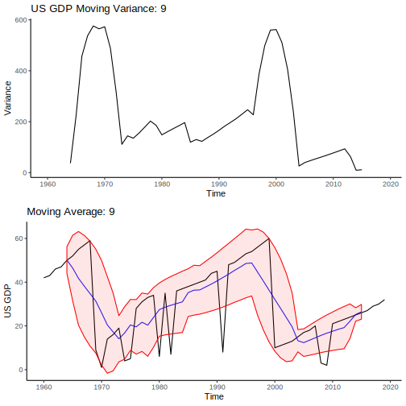
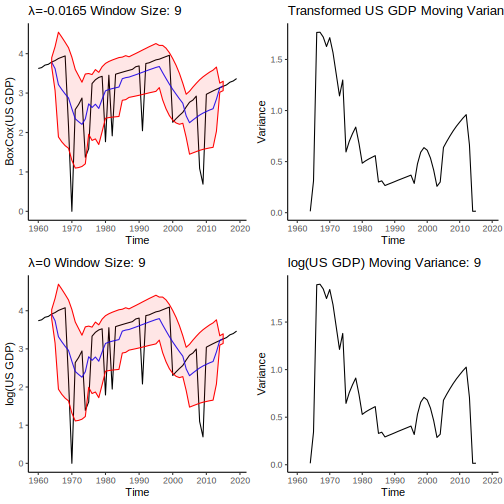
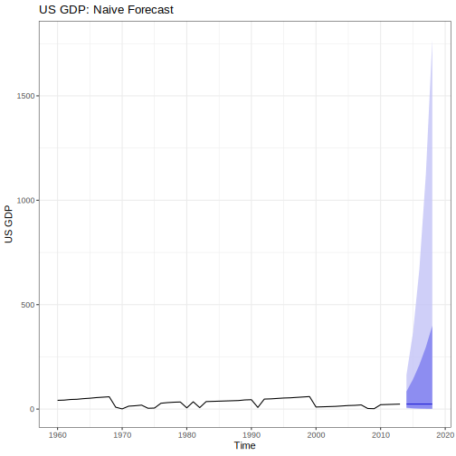
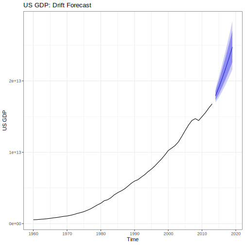
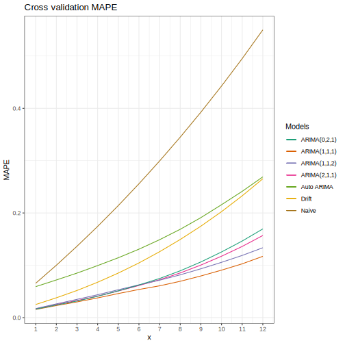
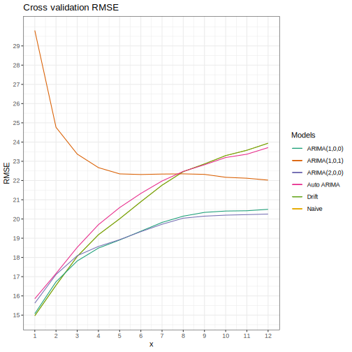

```{r setup, include=FALSE}
knitr::opts_chunk$set(echo = TRUE)
```

```{r, include=FALSE}
#Packages 

library(dplyr)
library(ggplot2)
library(forecast)
library(fpp2)
library(fma)
library(zoo)
library(cowplot)
```


```{r, echo = F, warning=F}
wdi_data <- read.csv('WDI2.csv', na.strings = c("..")) %>% 
  select(Country=Country.Code, Value=Series.Name, contains("X")) %>% 
  filter(Country=="USA") %>% 
  data.frame()

#wdi1 <- wdi_data[c(10, 11, 15, 16, 17, 18),]
wdi2 <- t(wdi_data)

rownames(wdi2) <- c("Country", "Value",1960:2019)
colnames(wdi2) <- wdi2[2,]

wdi <- wdi2[-(1:2),] 
#wdi <- wdi %>% as.data.frame() %>%  mutate_each(funs(as.numeric))
row.names(wdi) <- row.names(wdi2)[3:length(row.names(wdi2))]
wdi_ts <- ts(wdi, start = 1960)
#tail(wdi)

```


```{r, echo = F}
US_GDP <- ts(as.numeric(wdi[,"GDP (current US$)"]), start = 1960, frequency = 1)
```

# Forecast US GDP growth   


## **1) Variance Stabelization:**  


We first must determine if our data has non-constant variance (through time). We will draw a one standard deviation band around our data calculated from a moving window. If our data has constant variance, then we should expect this band to be uniform width across time. Further, we'll look at a plot of the variance of our data over time, we should expect this plot to have an approximately constant mean across time, and for the variance of this plot to be quite small. 

You can change the window size manually or animate the graph to see how increasing the window size effects the variance of US GDP.

```{=html}
<div class="centered">
  <div></div>
  <div>
    <input id="moving-average-button" type="number" name="variance" data-device=".svg" data-prefix="GDP_variance_" onchange="valueCheck(this)" value="9" defaultvalue="9" min="3" max="20" autocomplete="off"></input>
  </div>
  <div>
    <button class="spaced small red button" name="moving-average-button" onclick="animateVariance(this)">Animate Window Size</button>
  </div>
  <div></div>
</div>
</img>

<script>
function valueCheck(object){
  let value = parseInt(object.value);
  let max = object.max;
  let min = object.min;
  if(value > max){
  object.value = max
  } else if (value < min){
  object.value = min
  }
  var image = document.getElementById(object.name) ;
  var prefix = object.getAttribute("data-prefix") ;
  var device = object.getAttribute("data-device") ;
  let image_location  = "images/"+object.name+"/"+prefix+object.value+device ;
  console.log(image_location);
  image.src = image_location 
}
</script>
<script>
function animateVariance(object){
  var mab = document.getElementById(object.name);
  console.log(mab.value);
  let min = parseInt(mab.min) ;
  let max = parseInt(mab.max) ;
  function increment(num, max){
    if(num < max){
    let new_num = num + 1 ;
    mab.value = new_num.toString() ;
    mab.dispatchEvent(new Event('change'));
    setTimeout(increment, 500, new_num, max);
    } else {}
  };
  setTimeout(increment, 600, min, max, min);
}
</script>
```


```{r, eval=F, include=F}
# Code to generate SVG graphics for the animations above. Very lightweight compared to .png files.
mav_plot <- function(time_series, mav_size, titles = c("Window Size: ", "US GDP Moving Variance: "), ylabel = "US GDP"){
  moving_variance <- rollapply(time_series, width = mav_size, FUN = var, fill = NA)
  moving_average <- rollmean(time_series, k = mav_size, fill = NA)
  
  lower_var <- moving_average - sqrt(moving_variance) 
  upper_var <- moving_average + sqrt(moving_variance)
  
  #Ribbon plot
  vari <- autoplot(time_series) + 
    autolayer(moving_average, series = "Moving Average", color = "blue", alpha = 0.9) + 
    geom_ribbon(aes(ymax = upper_var, ymin = lower_var), color = "red", fill = "red", alpha = 0.1) + 
    ylab(ylabel) + ggtitle(paste0(titles[1], mav_size)) + theme_classic()
  
  #variance_plot
  mav <- autoplot(moving_variance) + theme_classic() + ggtitle(paste0(titles[2],mav_size)) + ylab("Variance")
  output <- list("Ribbon" = vari, "Variance" = mav)
  return(output)
}

for(i in 3:20){
  hmm <- mav_plot(US_GDP, i)
  plot_to_save <- plot_grid(hmm[[2]], hmm[[1]], ncol = 1)
  
  save_name = paste0("GDP_variance_", i,".svg")
  ggsave(save_name, plot = plot_to_save, path = "./images/variance/", device = "svg")
}

```

It should be clear that we need to transform our data because the variance is not constant throughout time. Here's a comparison of the automatically selected BoxCox transformation (lambda is automatically selected) versus a log transformation: 

```{=html}
<div class="centered">
  <div></div>
  <div>
  <input id="transformed-average-button" type="number" name="transformed" data-device=".svg" data-prefix="transformed_US_GDP_" onchange="valueCheck(this)" value="9" defaultvalue="9" min="3" max="20" autocomplete="off"></input>
  </div>
  <div></div>
  <div>
    <button class="small red button" name="transformed-average-button" onclick="animateVariance(this)">Animate Window Size</button>
  </div>
  <div></div>
</div>
</img>

```

Notice how the variance through time is very close to 0.9 across time for the log transformation. This transformation has fixed the non-constant variance of the data. The box-cox transformation must use a different criteria than the variance of a moving window, but part of it could be due to the scale difference between the two. 

```{r, echo = F}
lamb <- BoxCox.lambda(US_GDP)
transformed <- BoxCox(US_GDP, lambda = lamb)
```


```{r, eval=F, include=F}
for (i in 3:20){
  boxcox_version <- mav_plot(transformed, i, titles = c(paste0("λ=", round(lamb, digits = 4), " Window Size: "), "Box Cox US GDP Moving Variance: "), ylabel = "BoxCox(US GDP)")
  log_version <- mav_plot(log(US_GDP), i, titles = c("λ=0 Window Size: ", "log(US GDP) Moving Variance: "), ylabel = "log(US GDP)")
  plot_to_save <- plot_grid(boxcox_version[[1]], boxcox_version[[2]], log_version[[1]], log_version[[2]], ncol = 2)
  save_name <- paste0("transformed_US_GDP_",i,".svg")
  ggsave(save_name, plot = plot_to_save, path = "./images/transformed/", device = "svg")
}
plot_to_save <- plot_grid(mav, vari, mav2, vari2, ncol = 2)
plot_to_save

```

    
  b) Compare forecasting models (naive, seasonal naive, drift).  
    - the three simple forecasting models will be used to forecast 5 years past 2013.  
    - the forecasts will be visualized with their shaded confidence intervals.  
 
## Forecasting {.tabset .tabset-fade .tabset-pills}
 
Here we'll be looking at four different forecasting methods:
 
```{r, include = FALSE}
less <- window(US_GDP, end = c(2013))
test <- window(US_GDP, start = c(2014))
#autoplot(less)
```
 
 
### Naive
 
 As you can see, due to the log transform of our data, the 95% and 80% confidence intervals have been skewed towards larger predictions (i.e., the larger the time, the larger variance in positive predictions). However, it's important to check the residuals of our forecast!
 
```{=html}
<!-- <div class="button-group"> -->
<div class="centered">
<div></div>
 <div>
  <button class="small red button" name="naive_forecast" onclick="updateForecast(this)" value="original.svg">Original Scale Forecast</button>
 </div>
 <!--
  <div>
    <button class="small red button" name="naive_forecast" onclick="updateForecast(this)" value="clipped.svg">Clip Y-axis Forecast</button>
  </div>
 -->
 <div>
  <button class="small red button" name="naive_forecast" onclick="updateForecast(this)" value="log.svg">Log Scale Forecast</button>
 </div>
 <div></div>
</div>
<!-- </div> -->
 </img>

 <script>
 // Forcibly updates the image source to what it is supposed to be. Knitting replaces it with some nonsense. 
 (function fixsrc(){
 document.getElementById("naive_forecast").src = "./images/naive_forecast/original.svg";
 })()
 </script>
 <script>
 function updateForecast(button){
 let img = document.getElementById(button.name);
 let str = img.src;
 var lastSlash = str.lastIndexOf("/");
 var prefix = str.substring(0, lastSlash+1);
 console.log(prefix+button.value);
 img.src = prefix+button.value ;
 }
 </script>
```

 
```{r, eval = F, include = F}

#Generates all the plots for Naive Forecasting.

nfit <- naive(less, lambda = 0, h = 6)
plotted <- autoplot(less) + autolayer(nfit, alpha = 0.8, series = "Naive", col = "blue") + 
  ggtitle("US GDP: Naive Forecast (clipped scale)") + ylab("US GDP") + theme_bw() + coord_cartesian(ylim=c(0,100))
ggsave("clipped.svg", plot = plotted, path = "./images/naive_forecast/", device = "svg")


plotted <- autoplot(less) + autolayer(nfit, alpha = 0.8, series = "Naive", col = "blue") + 
  ggtitle("US GDP: Naive Forecast") + ylab("US GDP") + theme_bw()
ggsave("original.svg", plot = plotted, path = "./images/naive_forecast/", device = "svg")


tnfit <- naive(transformed, h = 6)
plotted <- autoplot(transformed) + autolayer(tnfit, alpha = 0.8, series = "Naive", col = "blue") +
  ggtitle("Log(US GDP): Naive Forecast") + ylab("Log(US GDP)") + theme_bw()
ggsave("log.svg", plot = plotted, path = "./images/naive_forecast/", device = "svg")

```
 
 
However, it's important to check the residuals of our forecast! As you can see below, we do not have approximately white-noise auto-correlations. Further, our residuals have constantish variance and mean. Notably, the residuals are approximately normally distributed, but they are not centered at zero which indicates that a drift model might be better. Therefore, we should not really trust the confidence intervalse on the predictions.
 
```{r, echo = FALSE}
nfit <- naive(less, lambda = 0, h = 6)
checkresiduals(nfit)
```
 
The Ljung-Box test, with a p-value of 0.515, helps us fail to reject instances of white noise residuals.


 
### Drift


```{=html}
<div class="centered">
  <div>
    <button class="small red button" name="drift_forecast" onclick="updateForecast(this)" value="original.svg">Original Scale Forecast</button>
  </div>
  <!-- Comment out stuff
  <div>
    <button class="small red button" name="drift_forecast" onclick="updateForecast(this)" value="clipped.svg">Clip Y-axis Forecast</button>
  </div>
  -->
  <div>
    <button class="small red button" name="drift_forecast" onclick="updateForecast(this)" value="log.svg">Log Scale Forecast</button>
  </div>
</div>
 
 
 </img>
 <script>
 // Forcibly updates the image source to what it is supposed to be. Knitting replaces it with some nonsense. 
 (function fixsrc(){
 document.getElementById("drift_forecast").src = "./images/drift_forecast/original.svg";
 })()
 </script>
```
 
```{r}
#, include = F}
drift <- rwf(less, drift = TRUE , lambda = lamb, h = 6)
```
 

```{r, eval = F, include = F}

#Generates all the plots for Naive Forecasting.

drift <- rwf(less, drift = TRUE , lambda = 0, h = 6)
plotted <- autoplot(less) + autolayer(drift, alpha = 0.8, series = "Drift", col = "blue") + 
  #autolayer(drift$fitted, alpha = 0.8, series = "Drift Line")+
  ggtitle("US GDP: Drift Forecast (clipped scale)") + ylab("US GDP") + theme_bw() #+ coord_cartesian(ylim=c(0,100))
ggsave("clipped.svg", plot = plotted, path = "./images/drift_forecast/", device = "svg")


plotted <- autoplot(less) + autolayer(drift, alpha = 0.8, series = "Drift", col = "blue") + 
  ggtitle("US GDP: Drift Forecast") + ylab("US GDP") + theme_bw()
ggsave("original.svg", plot = plotted, path = "./images/drift_forecast/", device = "svg")


tnfit <- rwf(log(US_GDP),drift = TRUE, h = 6)
plotted <- autoplot(log(US_GDP)) + autolayer(tnfit, alpha = 0.8, series = "Drift", col = "blue") +
  #autolayer(tnfit$fitted, alpha = 0.8, series = "Drift Line") +
  ggtitle("Log(US GDP): Drift Forecast") + ylab("Log(US GDP)") + theme_bw()
ggsave("log.svg", plot = plotted, path = "./images/drift_forecast/", device = "svg")

```
 
 
It's important to check to see if our drift parameter is statistically significant. In this case, the drift parameter is more than two standard errors from zero, so it's statistically significant. Further, with such a small drift of $\mu = 0.0647$, one might be tricked into thinking it's not practically significant; however, this is on the log-scale. For one step in time, the next value is on average, the previous value multiplied by 1.066 which is quite significant.

```{r}
summary(rwf(less, lambda = 0, drift = T, h=6))
```

Finally, we'll take a look at the residuals below. As you can see, the residual distribution is now centered around zero; however the auto-correlations don't resemble white noise -- so the confidence intervals are not trustworthy

```{r, echo = F}
checkresiduals(drift)
```


 
### Seasonal Naive 

The data does not appear to have any kind of seasonality. Maybe if the dataset had a frequency of 4 (i.e., quarterly data), we might be able to identify some seasonal components; however, we can still check to see if there is any indication of some non-standard seasonal components (e.g., ever decade). Seeing as how none of the lags greater than one look like the lag-1 plot, we can reasonably presume there aren't any larger seasonal components. 

```{r, echo = F}
gglagplot(log(less), lags = 12) + 
  ggtitle("Lag Plot of US GDP")+
  theme_bw()
```


### ARIMA

We've already stabelized the variance. The mean does not appear to be constant through time. To double check, we'll utilize the Kwiatkowski-Phillips-Schmidt-Shin test of stationarity. In this test, the null hypothesis is that our time series is level or trend stationary. We get a p-value of 0.01, in which we reject the null hypothesis -- this provides evidence that we need to do some differencing for mean-stabilization.

```{r, warning = FALSE, echo = F}
library(tseries)
kpss.test(log(US_GDP))
```

Now we must determine what sort of ARIMA(p,d,q) model to choose from. To do this, we will set d=1 and take a look at the ACF and PACF to make an educated guess at the order of p and q. Further differencing (i.e., d = 2) does improve the variance of the time series, and doesn't appear to over-difference the data; however, we'll roll with d=1, but include ARIMA(0,2,1) in the final model comparisons.

```{r, echo = F}
tsdisplay(diff(log(less), differences = 1), lag.max = 30)
```

Due to the shapes of the ACF and PACF, we will consider a little bit of AR and a little bit of MA, the best model will likely be ARMA(1,1,1). We'll do a comparison across all the models (RMSE, MAP, AICc) later. 

```{r}
model <- Arima(less, order = c(1,1,1), lambda = 0)
checkresiduals(model)
```

The Ljung-Box test indicates we fail to reject the hypothesis of white-noise residuals. Further, our residuals appear much more normally distributed (centered at 0) than the previous models.

Finally, we'll take a look at the forecasts.

```{r, echo = F}
#model <- auto.arima(less, lambda=0)
autoplot(less) + autolayer(forecast(model, h = 6)) +
  ggtitle("ARIMA(1,1,1) Forecasts") + ylab("US GDP") + theme_bw()
```

As you can see, the 80% and 95% confidence intervals on the forecasts are much more narrow, and these confidence intervals are more reliable than the previous Naive and Drift forecasts due to the normal distribution of the forecasts. 


### Model Comparisons

First, we will show that Naive and random walk with drift, and seasonal naive models are special cases of an ARIMA models!

```{=html}
<div class="centered">
  <div>
    <button class="small green button" name="hider" data-hide="proof" data-target-id="naive_arima" onclick="hideDiv(this)" value="on">Naive Proof</button>
  </div>
  <div>
    <button class="small green button" name="hider" data-hide="proof" data-target-id="seasonal_arima" onclick="hideDiv(this)" value="off">Seasonal Proof</button>
  </div>
  <div>
    <button class="small green button" name="hider" data-hide="proof" data-target-id="drift_arima" onclick="hideDiv(this)" value="off">Drift Proof</button>
  </div>
</div>
```

```{js, echo = F}
function hideDiv(button){
  var state = button.value;
  var divs_to_hide = button.getAttribute("data-hide");
  var div_to_show = button.getAttribute("data-target-id");
  var div_hide_array = document.getElementsByName(divs_to_hide);
  var button_off_array = document.getElementsByName(button.name);
  function doit(arr, buttons = true){
    if(buttons){
      for(var x=0; x<arr.length; x++){
        arr[x].value = "off"
      }
    } else {
      for(var x=0; x<arr.length; x++){
        arr[x].style.display = "none"
      }
    }
  }
  if (state == "on"){
    doit(button_off_array)
    doit(div_hide_array, false)
  } else {
    doit(div_hide_array, false)
    document.getElementById(div_to_show).style.display = "block";
    doit(button_off_array)
    button.value = "on"
  }
}
```


<div id="naive_arima" name="proof" style="display: block">

Theorem: Naive Forecasting model is equivalent to a specific ARIMA(p,d,q) model.

Proof:

Consider the modeling equation for the Naive model, and we will transform it into the modeling equation for ARIMA(0,1,0) with no intercept parameter.

$$
Y_t = Y_{t-1} + \epsilon_t \sim _{_{i.i.d.}} N(0,\sigma^2) \,\,\,\, (\text{Naive Model}) \\
\iff Y_t-Y_{t-1} = \epsilon_t \sim _{_{i.i.d.}} N(0,\sigma^2) \\
\iff Y^{\prime}_t = \epsilon_t \sim _{_{i.i.d.}} N(0,\sigma^2) \text{ such that } Y^{\prime}_t = Y_t - Y_{t-1}\,\,\,\, \\ (\text{ARIMA(0,1,0) Model})
$$
</div>
<div id="seasonal_arima" name="proof" style="display: none">

Theorem: A seasonal naive forecasting model (of seasonality frequency = m) is equivalent to a specific ARIMA(p,d,q)(P,D,Q) model.

Proof:

Consider the modeling equation for the seasonal naive model, and we will transform it into the modeling equation for ARIMA(0,0,0)(0,1,0) with an intercept parameter.

$$
Y_t =  Y_{t-m} + \epsilon_t \sim _{_{i.i.d.}} N(0,\sigma^2) \,\,\,\, (\text{Seasonal Naive Model}) \\
\iff Y_t-Y_{t-m} = \mu + \epsilon_t \sim _{_{i.i.d.}} N(0,\sigma^2) \\
\iff Y^{\prime}_t = \epsilon_t \sim _{_{i.i.d.}} N(0,\sigma^2) \text{ such that } Y^{\prime}_t = Y_t - Y_{t-m} \,\,\,\,  \\ (\text{ARIMA(0,0,0)(0,1,0) Model})
$$
</div>
<div id="drift_arima" name="proof" style="display: none">

Theorem: Random walk with drift forecasting model is equivalent to a specific ARIMA(p,d,q) model.

Proof:

Consider the modeling equation for the Random walk with drift model, and we will transform it into the modeling equation for ARIMA(0,1,0) with an intercept parameter.

$$
Y_t = \mu + Y_{t-1} + \epsilon_t \sim _{_{i.i.d.}} N(0,\sigma^2) \,\,\,\, (\text{Drift Model}) \\
\iff Y_t-Y_{t-1} = \mu + \epsilon_t \sim _{_{i.i.d.}} N(0,\sigma^2) \\
\iff Y^{\prime}_t = \mu + \epsilon_t \sim _{_{i.i.d.}} N(0,\sigma^2) \text{ such that } Y^{\prime}_t = Y_t - Y_{t-1} \\(\text{ARIMA(0,1,0) Model})
$$
</div>

Now we'll compare Naive, Drift, ARIMA(1,1,1) and some surrounding models through AICc, test RMSE, test MAPE, and cross validation. 

```{r, include = F}
training <- window(US_GDP, end = c(2013))
model_c <- c("naive", "drift", "hand.arima", "more_p", "more_q","more_d", "auto.arima")

models <- list()
models[["naive"]] <- Arima(training, order=c(0,1,0), include.mean = FALSE,lambda = 0)
models[["drift"]] <- Arima(training, order=c(0,1,0), include.drift = TRUE,lambda = 0)
models[["hand.arima"]] <- Arima(training, order=c(1,1,1),lambda = 0)
models[['more_p']] <- Arima(training, order = c(2,1,1),lambda = 0)
models[['more_q']] <- Arima(training, order = c(1,1,2),lambda = 0)
models[['more_d']] <- Arima(training, order = c(0,2,1),lambda = 0)
models[["auto.arima"]] <- auto.arima(training)


hs_arima <- accuracy(forecast(model, h = 6), test)
for.metrics <- function(model){accuracy(forecast(model, h=6), test)}

model.metrics <- lapply(models, for.metrics)


a_fun <- function(x, h){forecast(Arima(x, order=c(0,1,0), include.mean = FALSE,lambda = 0),h=h)}

cvfun <- list()
cvfun[["naive"]] <- function(x, h){forecast(Arima(x, order=c(0,1,0), include.mean = FALSE,lambda = 0),h)}
cvfun[["drift"]] <- function(x, h){forecast(Arima(x, order=c(0,1,0), include.drift = TRUE,lambda = 0), h)}
cvfun[["hand.arima"]] <- function(x, h){forecast(Arima(x, order=c(1,1,1),lambda = 0),h)}
cvfun[['more_p']] <- function(x, h){forecast(Arima(x, order = c(2,1,1),lambda = 0),h)}
cvfun[['more_q']] <- function(x, h){forecast(Arima(x, order = c(1,1,2),lambda = 0),h)}
cvfun[['more_d']] <- function(x, h){forecast(Arima(x, order = c(0,2,1),lambda = 0),h)}
cvfun[["auto.arima"]] <- function(x,h){forecast(auto.arima(x), h)}

#apply.this <- function(fun){tsCV(US_GDP, fun)}
RMSE <- function(CVerrors){sqrt(mean(CVerrors^2, na.rm=TRUE))}
MAPE <- function(CVerrors){mean(abs(CVerrors/US_GDP), na.rm=TRUE)}
#CV_errors <- lapply(cvfun, apply.this)
```


```{r, include=F, eval=F}
cv_results <- list("rmse" = list(), "mape"=list())
x <- 1:12
for(i in x){
  apply.this <- function(fun){tsCV(US_GDP, fun, h = i)}
  CV_errors <- lapply(cvfun,apply.this)
  CV_rmse <- lapply(CV_errors, RMSE)
  CV_mape <- lapply(CV_errors, MAPE)
  for (j in model_c){
    cv_results[["rmse"]][[j]] <- c(cv_results[["rmse"]][[j]], CV_rmse[[j]])
    cv_results[["mape"]][[j]] <- c(cv_results[["mape"]][[j]], CV_mape[[j]])
  }
}

rmse_cv <-  do.call(cbind.data.frame, cv_results[["rmse"]])
mape_cv <-  do.call(cbind.data.frame, cv_results[["mape"]])
rmse_cv <- as.tbl(cbind(rmse_cv, x))
mape_cv <- as.tbl(cbind(mape_cv, x))
```


```{r, include=F, eval=F}
library(RColorBrewer)

rmse_cv_plot <- ggplot(data = rmse_cv, aes(x= x)) + 
  geom_line(aes(y = naive, col = "Naive"))+
  geom_line(aes(y = drift, col = "Drift"))+
  geom_line(aes(y = hand.arima, col = "ARIMA(1,1,1)"))+
  geom_line(aes(y = more_p, col = "ARIMA(2,1,1)"))+
  geom_line(aes(y = more_q, col = "ARIMA(1,1,2)"))+
  geom_line(aes(y = more_d, col = "ARIMA(0,2,1)")) +
  geom_line(aes(y = auto.arima, col = "Auto ARIMA"))+
  scale_color_discrete(name = "Models")+
  labs(color = "Models")+ ylab("RMSE") +
  scale_x_continuous(breaks = 1:12)+
  #scale_color_manual(values=sample(col_vector, n))+
  scale_color_brewer(palette = "Dark2")+
  ggtitle("Cross validation RMSE")+
  theme_bw()
ggsave(rmse_cv_plot, filename = "rmse.svg", device = "svg", path = "./images/cross_validation/")

mape_cv_plot <- ggplot(data = mape_cv, aes(x= x)) + 
  geom_line(aes(y = naive, col = "Naive"))+
  geom_line(aes(y = drift, col = "Drift"))+
  geom_line(aes(y = hand.arima, col = "ARIMA(1,1,1)"))+
  geom_line(aes(y = more_p, col = "ARIMA(2,1,1)"))+
  geom_line(aes(y = more_q, col = "ARIMA(1,1,2)"))+
  geom_line(aes(y = more_d, col = "ARIMA(0,2,1)")) +
  geom_line(aes(y = auto.arima, col = "Auto ARIMA"))+
  scale_color_discrete(name = "Models")+
  labs(color = "Models")+ ylab("MAPE") +
  scale_x_continuous(breaks = 1:12)+
  #scale_color_manual(values=sample(col_vector, n))+
  scale_color_brewer(palette = "Dark2")+
  ggtitle("Cross validation MAPE")+
  theme_bw()
ggsave(mape_cv_plot, filename = "mape.svg", device = "svg", path = "./images/cross_validation/")
```


```{js, echo=F}
function changeCV(button){
  var mape_img = document.getElementById("mape");
  var rmse_img = document.getElementById("rmse");
  console.log(button.value)
  if (button.value == "mape"){
    button.value = "rmse" ;
    button.innerHTML = "Show MAPE";
    mape_img.style.display = "none";
    rmse_img.style.display = "block";
  } else {
    button.value = "mape";
    button.innerHTML = "Show RMSE";
    mape_img.style.display = "block";
    rmse_img.style.display = "none";
  }
}


```


```{=html}
<div class="centered">
<button class="small blue button" value="mape" onclick="changeCV(this)">Show RMSE</button>
</div>
</img>
</img>

```


Let's take a look at the test set RMSE, MAPE, and the model AICc:

```{r, echo = F}
get_aicc <- function(m){m$aicc}
get_test_rmse <- function(mm){mm[2,2]}
get_test_mape <- function(mm){mm[2,5]}

test_mape <- do.call(cbind.data.frame,lapply(model.metrics, get_test_mape))
test_rmse <- do.call(cbind.data.frame,lapply(model.metrics, get_test_rmse))
test_aicc <- do.call(cbind.data.frame,lapply(models, get_aicc))
df <- rbind.data.frame(test_mape, test_rmse, test_aicc)
hmm <- cbind(df, c("Test MAPE", "Test RMSE", "AICc"))
colnames(hmm)[8] <- "stat"
bar_data <-  tidyr::pivot_longer(as_tibble(hmm), cols = c(naive, drift, hand.arima, more_p, more_q, more_d, auto.arima))
#row.names(df) <- c("Test Mape", "Test RMSE", "AICc")
```


```{r, echo = F}
library(viridis)
ggplot(bar_data, aes(fill=name, y=value, x=name)) + 
  geom_bar(position="dodge", stat="identity") + 
  scale_fill_viridis(discrete = T, option = "E") +
  ggtitle("AICc, Test RMSE and Test Mape comparison") +
  facet_wrap(~stat, scales = "free") +
  theme_bw() + labs(fill = "Model")
  xlab("")

```

