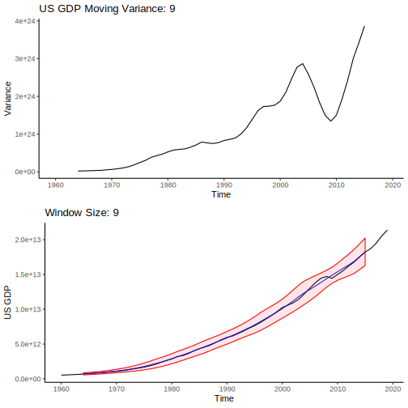
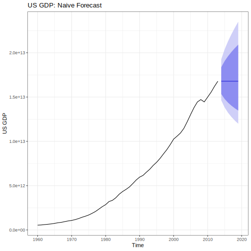
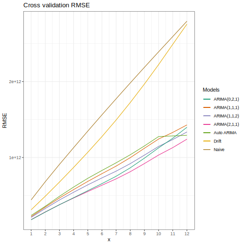

```{r setup, include=FALSE}
knitr::opts_chunk$set(echo = TRUE)
```

```{r, include=FALSE}
#Packages 

library(dplyr)
library(ggplot2)
library(forecast)
library(fpp2)
library(fma)
library(zoo)
library(cowplot)
#install.packages("PerformanceAnalytics")
library(PerformanceAnalytics)
library(tseries)
```


```{r, echo = F, warning=F}
wdi_data <- read.csv('WDI2.csv', na.strings = c("..")) %>% 
  select(Country=Country.Code, Value=Series.Name, contains("X")) %>% 
  filter(Country=="USA") %>% 
  data.frame()

#wdi1 <- wdi_data[c(10, 11, 15, 16, 17, 18),]
wdi2 <- t(wdi_data)

rownames(wdi2) <- c("Country", "Value",1960:2019)
colnames(wdi2) <- wdi2[2,]

wdi <- wdi2[-(1:2),] 
wdi <- wdi %>% as.data.frame() %>%  mutate_each(funs(as.numeric))
row.names(wdi) <- row.names(wdi2)[3:length(row.names(wdi2))]
wdi_ts <- ts(wdi, start = 1960)


```


```{r, echo = F}
US_GDP <- as.ts(ts(wdi[,"GDP (current US$)"], start = 1960, frequency = 1))
```

# Forecast US GDP growth   


## **1) Variance Stabelization:**  


We first must determine if our data has non-constant variance (through time). We will draw a one standard deviation band around our data calculated from a moving window. If our data has constant variance, then we should expect this band to be uniform width across time. Further, we'll look at a plot of the variance of our data over time, we should expect this plot to have an approximately constant mean across time, and for the variance of this plot to be quite small. 

You can change the window size manually or animate the graph to see how increasing the window size effects the variance of US GDP.

```{=html}
<div class="centered">
  <div></div>
  <div>
    <input id="moving-average-button" type="number" name="variance" data-device=".svg" data-prefix="GDP_variance_" onchange="valueCheck(this)" value="9" defaultvalue="9" min="3" max="20" autocomplete="off"></input>
  </div>
  <div>
    <button class="spaced small red button" name="moving-average-button" onclick="animateVariance(this)">Animate Window Size</button>
  </div>
  <div></div>
</div>
</img>

<script>
function valueCheck(object){
  let value = parseInt(object.value);
  let max = object.max;
  let min = object.min;
  if(value > max){
  object.value = max
  } else if (value < min){
  object.value = min
  }
  var image = document.getElementById(object.name) ;
  var prefix = object.getAttribute("data-prefix") ;
  var device = object.getAttribute("data-device") ;
  let image_location  = "images/"+object.name+"/"+prefix+object.value+device ;
  console.log(image_location);
  image.src = image_location 
}
</script>
<script>
function animateVariance(object){
  var mab = document.getElementById(object.name);
  console.log(mab.value);
  let min = parseInt(mab.min) ;
  let max = parseInt(mab.max) ;
  function increment(num, max){
    if(num < max){
    let new_num = num + 1 ;
    mab.value = new_num.toString() ;
    mab.dispatchEvent(new Event('change'));
    setTimeout(increment, 500, new_num, max);
    } else {}
  };
  setTimeout(increment, 600, min, max, min);
}
</script>
```


```{r, eval=F, include=F}
# Code to generate SVG graphics for the animations above. Very lightweight compared to .png files.
mav_plot <- function(time_series, mav_size, titles = c("Window Size: ", "US GDP Moving Variance: "), ylabel = "US GDP"){
  moving_variance <- rollapply(time_series, width = mav_size, FUN = var, fill = NA)
  moving_average <- rollmean(time_series, k = mav_size, fill = NA)
  
  lower_var <- moving_average - sqrt(moving_variance) 
  upper_var <- moving_average + sqrt(moving_variance)
  
  #Ribbon plot
  vari <- autoplot(time_series) + 
    autolayer(moving_average, series = "Moving Average", color = "blue", alpha = 0.9) + 
    geom_ribbon(aes(ymax = upper_var, ymin = lower_var), color = "red", fill = "red", alpha = 0.1) + 
    ylab(ylabel) + ggtitle(paste0(titles[1], mav_size)) + theme_classic()
  
  #variance_plot
  mav <- autoplot(moving_variance) + theme_classic() + ggtitle(paste0(titles[2],mav_size)) + ylab("Variance")
  output <- list("Ribbon" = vari, "Variance" = mav)
  return(output)
}

for(i in 3:20){
  hmm <- mav_plot(US_GDP, i)
  plot_to_save <- plot_grid(hmm[[1]], hmm[[2]], ncol = 1)
  
  save_name = paste0("GDP_variance_", i,".svg")
  ggsave(save_name, plot = plot_to_save, path = "./images/variance/", device = "svg")
}

```

It should be clear that we need to transform our data because the variance is not constant throughout time. Here's a comparison of the automatically selected BoxCox transformation (lambda is automatically selected) versus a log transformation: 

```{=html}
<div class="centered">
  <div></div>
  <div>
  <input id="transformed-average-button" type="number" name="transformed" data-device=".svg" data-prefix="transformed_US_GDP_" onchange="valueCheck(this)" value="9" defaultvalue="9" min="3" max="20" autocomplete="off"></input>
  </div>
  <div></div>
  <div>
    <button class="small red button" name="transformed-average-button" onclick="animateVariance(this)">Animate Window Size</button>
  </div>
  <div></div>
</div>
</img>

```

Notice how the variance through time is very close to 0.9 across time. This transformation has fixed the variance of the data.

```{r, eval=F, include=F}
lamb <- BoxCox.lambda(US_GDP)
transformed <- BoxCox(US_GDP, lambda = lamb)

for (i in 3:20){
  boxcox_version <- mav_plot(transformed, i, titles = c(paste0("λ=", round(lamb, digits = 4), " Window Size: "), "Box Cox US GDP Moving Variance: "), ylabel = "BoxCox(US GDP)")
  log_version <- mav_plot(log(US_GDP), i, titles = c("λ=0 Window Size: ", "log(US GDP) Moving Variance: "), ylabel = "log(US GDP)")
  plot_to_save <- plot_grid(boxcox_version[[1]], boxcox_version[[2]], log_version[[1]], log_version[[2]], ncol = 2)
  save_name <- paste0("transformed_US_GDP_",i,".svg")
  ggsave(save_name, plot = plot_to_save, path = "./images/transformed/", device = "svg")
}
plot_to_save <- plot_grid(mav, vari, mav2, vari2, ncol = 2)
plot_to_save

```

    
  b) Compare forecasting models (naive, seasonal naive, drift).  
    - the three simple forecasting models will be used to forecast 5 years past 2013.  
    - the forecasts will be visualized with their shaded confidence intervals.  
 
## Forecasting {.tabset .tabset-fade .tabset-pills}
 
Here we'll be looking at four different forecasting methods:
 
```{r, include = FALSE}
less <- window(US_GDP, end = c(2013))
test <- window(US_GDP, start = c(2014))
#autoplot(less)
```
 
 
### Naive
 
 As you can see, due to the log transform of our data, the 95% and 80% confidence intervals have been skewed towards larger predictions (i.e., the larger the time, the larger variance in positive predictions). However, it's important to check the residuals of our forecast!
 
```{=html}
<!-- <div class="button-group"> -->
<div class="centered">
 <div>
  <button class="small red button" name="naive_forecast" onclick="updateForecast(this)" value="original.svg">Original Scale Forecast</button>
 </div>
 <div>
   <button class="small red button" name="naive_forecast" onclick="updateForecast(this)" value="clipped.svg">Clip Y-axis Forecast</button>
 </div>
 <div>
  <button class="small red button" name="naive_forecast" onclick="updateForecast(this)" value="log.svg">Log Scale Forecast</button>
 </div>
</div>
<!-- </div> -->
 </img>

 <script>
 // Forcibly updates the image source to what it is supposed to be. Knitting replaces it with some nonsense. 
 (function fixsrc(){
 document.getElementById("naive_forecast").src = "./images/naive_forecast/original.svg";
 })()
 </script>
 <script>
 function updateForecast(button){
 let img = document.getElementById(button.name);
 let str = img.src;
 var lastSlash = str.lastIndexOf("/");
 var prefix = str.substring(0, lastSlash+1);
 console.log(prefix+button.value);
 img.src = prefix+button.value ;
 }
 </script>
```

 
```{r, eval = F, include = F}

#Generates all the plots for Naive Forecasting.

nfit <- naive(less, lambda = 0, h = 6)
plotted <- autoplot(less) + autolayer(nfit, alpha = 0.8, series = "Naive", col = "blue") + 
  ggtitle("US GDP: Naive Forecast (clipped scale)") + ylab("US GDP") + theme_bw() + coord_cartesian(ylim=c(0,100))
ggsave("clipped.svg", plot = plotted, path = "./images/naive_forecast/", device = "svg")


plotted <- autoplot(less) + autolayer(nfit, alpha = 0.8, series = "Naive", col = "blue") + 
  ggtitle("US GDP: Naive Forecast") + ylab("US GDP") + theme_bw()
ggsave("original.svg", plot = plotted, path = "./images/naive_forecast/", device = "svg")


tnfit <- naive(transformed, h = 6)
plotted <- autoplot(transformed) + autolayer(tnfit, alpha = 0.8, series = "Naive", col = "blue") +
  ggtitle("Log(US GDP): Naive Forecast") + ylab("Log(US GDP)") + theme_bw()
ggsave("log.svg", plot = plotted, path = "./images/naive_forecast/", device = "svg")

```
 
 
However, it's important to check the residuals of our forecast! As you can see below, we have approximately white-noise auto-correlations. Further, our residuals have constantish variance and mean. Notably, the residuals are not normally distributed.
 
```{r, echo = FALSE}
nfit <- naive(less, lambda = 0, h = 6)
checkresiduals(nfit)
```
 
The Ljung-Box test, with a p-value of 0.515, helps us fail to reject instances of white noise residuals.


 
### Drift


```{=html}
<div class="centered">
  <div>
    <button class="small red button" name="drift_forecast" onclick="updateForecast(this)" value="original.svg">Original Scale Forecast</button>
  </div>
  <div>
    <button class="small red button" name="drift_forecast" onclick="updateForecast(this)" value="clipped.svg">Clip Y-axis Forecast</button>
  </div>
  <div>
    <button class="small red button" name="drift_forecast" onclick="updateForecast(this)" value="log.svg">Log Scale Forecast</button>
  </div>
</div>
 
 
 </img>
 <script>
 // Forcibly updates the image source to what it is supposed to be. Knitting replaces it with some nonsense. 
 (function fixsrc(){
 document.getElementById("drift_forecast").src = "./images/drift_forecast/original.svg";
 })()
 </script>
```
 
```{r, include = F}
drift <- rwf(less, drift = TRUE , lambda = 0, h = 6)
```
 

```{r, eval = F, include = F}

#Generates all the plots for Naive Forecasting.

drift <- rwf(less, drift = TRUE , lambda = 0, h = 6)
plotted <- autoplot(less) + autolayer(drift, alpha = 0.8, series = "Drift", col = "blue") + 
  #autolayer(drift$fitted, alpha = 0.8, series = "Drift Line")+
  ggtitle("US GDP: Drift Forecast (clipped scale)") + ylab("US GDP") + theme_bw() + coord_cartesian(ylim=c(0,100))
ggsave("clipped.svg", plot = plotted, path = "./images/drift_forecast/", device = "svg")


plotted <- autoplot(less) + autolayer(drift, alpha = 0.8, series = "Drift", col = "blue") + 
  ggtitle("US GDP: Drift Forecast") + ylab("US GDP") + theme_bw()
ggsave("original.svg", plot = plotted, path = "./images/drift_forecast/", device = "svg")


tnfit <- rwf(transformed,drift = TRUE, h = 6)
plotted <- autoplot(transformed) + autolayer(tnfit, alpha = 0.8, series = "Drift", col = "blue") +
  #autolayer(tnfit$fitted, alpha = 0.8, series = "Drift Line") +
  ggtitle("Log(US GDP): Drift Forecast") + ylab("Log(US GDP)") + theme_bw()
ggsave("log.svg", plot = plotted, path = "./images/drift_forecast/", device = "svg")

```
 
 
It's important to check to see if our drift parameter is statistically significant. In this case, the drift parameter is less than one standard error from zero, so it's not statistically significant. Further, with such a small drift of $\mu = -0.0106$, this model doesn't practically differ significantly from naive forecast.

```{r}
summary(rwf(less, lambda = 0, drift = T, h=5))
```

 
### Seasonal Naive 

The data does not appear to have any kind of seasonality. Maybe if the dataset had a frequency of 4 (i.e., quarterly data), we might be able to identify some seasonal components; however, we can still check to see if there is any indication of some non-standard seasonal components (e.g., ever decade).

```{r, echo = F}
gglagplot(log(less), lags = 12) + 
  ggtitle("Lag Plot of US GDP")+
  theme_bw()
```


The lag plot indicates that there does not appear to be any seasonal components
    
    

### ARIMA

We've already stabelized the variance. The mean appears to be relatively constant throughout time. To double check, we'll utilize the Kwiatkowski-Phillips-Schmidt-Shin test of stationarity. In this test, the null hypothesis is that our time series is level or trend stationary. We get a p-value of 0.1, in which we fail to reject the null hypothesis -- this provides evidence that we do not need to do any differencing for mean-stabilization.

```{r, warning = FALSE, echo = F}
library(tseries)
kpss.test(log(US_GDP))
```

Now we must determine what sort of ARMA(p,q) model to choose from. To do this, we will take a look at the ACF and PACF to make an educated guess at the order of p and q.

```{r, echo = F}
tsdisplay(log(less), lag.max = 30)
```

Due to the exponentially decreasing nature of subsequent lags after lag-1 in the ACF plot, and the single lag-1 spike in the PACF, this indicates that the best model will likely be ARMA(1,0). We'll do a comparison across all the models (RMSE, MAP, AICc) later. 


```{r}
model <- Arima(less, order = c(1,0,0), lambda = 0)
checkresiduals(model)
```

The Ljung-Box test indicates we fail to reject the hypothesis of white-noise residuals. Further, our residuals appear much more normally distributed (centered at 0) than the previous models.

Finally, we'll take a look at the forecasts.

```{r, echo = F}
model <- auto.arima(less, lambda=0)
autoplot(less) + autolayer(forecast(model, h = 6)) +
  ggtitle("ARIMA(1,0,0) Forecasts") + ylab("US GDP") + theme_bw()
```

As you can see, the 80% and 95% confidence intervals on the forecasts are much more narrow, and these confidence intervals are more reliable than the previous Naive and Drift forecasts due to the normal distribution of the forecasts. 


### Model Comparisons

First, we will show that Naive and random walk with drift, and seasonal naive models are special cases of an ARIMA models!

```{=html}
<div class="centered">
  <div>
    <button class="small green button" name="hider" data-hide="proof" data-target-id="naive_arima" onclick="hideDiv(this)" value="on">Naive Proof</button>
  </div>
  <div>
    <button class="small green button" name="hider" data-hide="proof" data-target-id="seasonal_arima" onclick="hideDiv(this)" value="off">Seasonal Proof</button>
  </div>
  <div>
    <button class="small green button" name="hider" data-hide="proof" data-target-id="drift_arima" onclick="hideDiv(this)" value="off">Drift Proof</button>
  </div>
</div>
```

```{js, echo = F}
function hideDiv(button){
  var state = button.value;
  var divs_to_hide = button.getAttribute("data-hide");
  var div_to_show = button.getAttribute("data-target-id");
  var div_hide_array = document.getElementsByName(divs_to_hide);
  var button_off_array = document.getElementsByName(button.name);
  function doit(arr, buttons = true){
    if(buttons){
      for(var x=0; x<arr.length; x++){
        arr[x].value = "off"
      }
    } else {
      for(var x=0; x<arr.length; x++){
        arr[x].style.display = "none"
      }
    }
  }
  if (state == "on"){
    doit(button_off_array)
    doit(div_hide_array, false)
  } else {
    doit(div_hide_array, false)
    document.getElementById(div_to_show).style.display = "block";
    doit(button_off_array)
    button.value = "on"
  }
}
```


<div id="naive_arima" name="proof" style="display: block">

Theorem: Naive Forecasting model is equivalent to a specific ARIMA(p,d,q) model.

Proof:

Consider the modeling equation for the Naive model, and we will transform it into the modeling equation for ARIMA(0,1,0) with no intercept parameter.

$$
Y_t = Y_{t-1} + \epsilon_t \sim _{_{i.i.d.}} N(0,\sigma^2) \,\,\,\, (\text{Naive Model}) \\
\iff Y_t-Y_{t-1} = \epsilon_t \sim _{_{i.i.d.}} N(0,\sigma^2) \\
\iff Y^{\prime}_t = \epsilon_t \sim _{_{i.i.d.}} N(0,\sigma^2) \text{ such that } Y^{\prime}_t = Y_t - Y_{t-1}\,\,\,\, \\ (\text{ARIMA(0,1,0) Model})
$$
</div>
<div id="seasonal_arima" name="proof" style="display: none">

Theorem: A seasonal naive forecasting model (of seasonality frequency = m) is equivalent to a specific ARIMA(p,d,q)(P,D,Q) model.

Proof:

Consider the modeling equation for the seasonal naive model, and we will transform it into the modeling equation for ARIMA(0,0,0)(0,1,0) with an intercept parameter.

$$
Y_t =  Y_{t-m} + \epsilon_t \sim _{_{i.i.d.}} N(0,\sigma^2) \,\,\,\, (\text{Seasonal Naive Model}) \\
\iff Y_t-Y_{t-m} = \epsilon_t \sim _{_{i.i.d.}} N(0,\sigma^2) \\
\iff Y^{\prime}_t = \epsilon_t \sim _{_{i.i.d.}} N(0,\sigma^2) \text{ such that } Y^{\prime}_t = Y_t - Y_{t-m} \,\,\,\,  \\ (\text{ARIMA(0,0,0)(0,1,0) Model})
$$
</div>
<div id="drift_arima" name="proof" style="display: none">

Theorem: Random walk with drift forecasting model is equivalent to a specific ARIMA(p,d,q) model.

Proof:

Consider the modeling equation for the Random walk with drift model, and we will transform it into the modeling equation for ARIMA(0,1,0) with an intercept parameter.

$$
Y_t = \mu + Y_{t-1} + \epsilon_t \sim _{_{i.i.d.}} N(0,\sigma^2) \,\,\,\, (\text{Drift Model}) \\
\iff Y_t-Y_{t-1} = \mu + \epsilon_t \sim _{_{i.i.d.}} N(0,\sigma^2) \\
\iff Y^{\prime}_t = \mu + \epsilon_t \sim _{_{i.i.d.}} N(0,\sigma^2) \text{ such that } Y^{\prime}_t = Y_t - Y_{t-1} \\(\text{ARIMA(0,1,0) Model})
$$
</div>

Now we'll compare Naive, Drift, ARIMA(1,0,0) and some surrounding models through AICc, test RMSE, test MAPE, and cross validation. 

```{r, include = F}
training <- window(US_GDP, end = c(2013))
model_c <- c("naive", "drift", "hand.arima", "more_p", "more_q", "auto.arima")

models <- list()
models[["naive"]] <- Arima(training, order=c(0,1,0), include.mean = FALSE,lambda = 0)
models[["drift"]] <- Arima(training, order=c(0,1,0), include.mean = TRUE,lambda = 0)
models[["hand.arima"]] <- Arima(training, order=c(1,0,0),lambda = 0)
models[['more_p']] <- Arima(training, order = c(2,0,0),lambda = 0)
models[['more_q']] <- Arima(training, order = c(1,0,1),lambda = 0)
models[["auto.arima"]] <- auto.arima(training)


hs_arima <- accuracy(forecast(model, h = 6), test)
for.metrics <- function(model){accuracy(forecast(model, h=6), test)}

model.metrics <- lapply(models, for.metrics)


a_fun <- function(x, h){forecast(Arima(x, order=c(0,1,0), include.mean = FALSE,lambda = 0),h=h)}

cvfun <- list()
cvfun[["naive"]] <- function(x, h){forecast(Arima(x, order=c(0,1,0), include.mean = FALSE,lambda = 0),h)}
cvfun[["drift"]] <- function(x, h){forecast(Arima(x, order=c(0,1,0), include.mean = TRUE,lambda = 0), h)}
cvfun[["hand.arima"]] <- function(x, h){forecast(Arima(x, order=c(1,0,0),lambda = 0),h)}
cvfun[['more_p']] <- function(x, h){forecast(Arima(x, order = c(2,0,0),lambda = 0),h)}
cvfun[['more_q']] <- function(x, h){forecast(Arima(x, order = c(1,0,1),lambda = 0),h)}
cvfun[["auto.arima"]] <- function(x,h){forecast(auto.arima(x), h)}

#apply.this <- function(fun){tsCV(US_GDP, fun)}
RMSE <- function(CVerrors){sqrt(mean(CVerrors^2, na.rm=TRUE))}
MAPE <- function(CVerrors){mean(abs(CVerrors/US_GDP), na.rm=TRUE)}
#CV_errors <- lapply(cvfun, apply.this)
```


```{r, include=F, eval=F}
cv_results <- list("rmse" = list(), "mape"=list())
x <- 1:12
for(i in x){
  apply.this <- function(fun){tsCV(US_GDP, fun, h = i)}
  CV_errors <- lapply(cvfun,apply.this)
  CV_rmse <- lapply(CV_errors, RMSE)
  CV_mape <- lapply(CV_errors, MAPE)
  for (j in model_c){
    cv_results[["rmse"]][[j]] <- c(cv_results[["rmse"]][[j]], CV_rmse[[j]])
    cv_results[["mape"]][[j]] <- c(cv_results[["mape"]][[j]], CV_mape[[j]])
  }
}

rmse_cv <-  do.call(cbind.data.frame, cv_results[["rmse"]])
mape_cv <-  do.call(cbind.data.frame, cv_results[["mape"]])
rmse_cv <- as.tbl(cbind(rmse_cv, x))
mape_cv <- as.tbl(cbind(mape_cv, x))
```


```{r, include=F, eval=F}
library(RColorBrewer)

rmse_cv_plot <- ggplot(data = rmse_cv, aes(x= x)) + 
  geom_line(aes(y = naive, col = "Naive"))+
  geom_line(aes(y = drift, col = "Drift"))+
  geom_line(aes(y = hand.arima, col = "ARIMA(1,0,0)"))+
  geom_line(aes(y = more_p, col = "ARIMA(2,0,0)"))+
  geom_line(aes(y = more_q, col = "ARIMA(1,0,1)"))+
  geom_line(aes(y = auto.arima, col = "Auto ARIMA"))+
  scale_color_discrete(name = "Models")+
  labs(color = "Models")+ ylab("RMSE") +
  scale_x_continuous(breaks = 1:12)+
  scale_y_continuous(breaks = 15:29)+
  #scale_color_manual(values=sample(col_vector, n))+
  scale_color_brewer(palette = "Dark2")+
  ggtitle("Cross validation RMSE")+
  theme_bw()
ggsave(rmse_cv_plot, filename = "rmse.svg", device = "svg", path = "./images/cross_validation/")

mape_cv_plot <- ggplot(data = mape_cv, aes(x= x)) + 
  geom_line(aes(y = naive, col = "Naive"))+
  geom_line(aes(y = drift, col = "Drift"))+
  geom_line(aes(y = hand.arima, col = "ARIMA(1,0,0)"))+
  geom_line(aes(y = more_p, col = "ARIMA(2,0,0)"))+
  geom_line(aes(y = more_q, col = "ARIMA(1,0,1)"))+
  geom_line(aes(y = auto.arima, col = "Auto ARIMA"))+
  scale_color_discrete(name = "Models")+
  labs(color = "Models")+ ylab("MAPE") +
  scale_x_continuous(breaks = 1:12)+
  #scale_color_manual(values=sample(col_vector, n))+
  scale_color_brewer(palette = "Dark2")+
  ggtitle("Cross validation MAPE")+
  theme_bw()
ggsave(mape_cv_plot, filename = "mape.svg", device = "svg", path = "./images/cross_validation/")
```


```{js, echo=F}
function changeCV(button){
  var mape_img = document.getElementById("mape");
  var rmse_img = document.getElementById("rmse");
  console.log(button.value)
  if (button.value == "mape"){
    button.value = "rmse" ;
    button.innerHTML = "Show MAPE";
    mape_img.style.display = "none";
    rmse_img.style.display = "block";
  } else {
    button.value = "mape";
    button.innerHTML = "Show RMSE";
    mape_img.style.display = "block";
    rmse_img.style.display = "none";
  }
}


```


```{=html}
<div class="centered">
<button class="small blue button" value="mape" onclick="changeCV(this)">Show RMSE</button>
</div>
</img>
</img>

```


  c) Use cross validation to confirm which simple forecasting method is best.  

    - the forecast accuracy reported will be RMSE. 
    - CV will be performed similarly to the way it was used in a bonus homework question earlier in the semester.  
    - The chosen forecasting model will be the one that performs best in the CV procedure  

```{r}
tsdisplay(log(US_GDP))

```

  e) Validate best model looking at metrics  
    - AIC and Test RMSE will be used to choose the between the selected ARIMA and the selected simple forecasting method. 
    - these metrics were chosen instead of cross validation because of manual selection process of the best ARIMA model.  
    

  f) Check residuals to further validate best model choice as well as confirm goodness of fit and quality of predictions.  
  
```{r}
regression_data<- wdi[35:nrow(wdi),c(3,15)]
colnames(regression_data)<- c("share_youth_NEET", "unemployment_total")
reg_data <- transform(regression_data, share_youth_NEET = as.numeric(share_youth_NEET), unemployment_total = as.numeric(unemployment_total))
```

a) Confirm correlation between explanatory and response variable  
    - that is, report the correlation with plot of the relationship between share of youth NEETs and unemployment rate in the US   \
    
The correlation between the share of youth that are not employed, in education or job training and the overall unemployment rate across time is 0.90. The strength of this correlation, as well as the clear linear trend depicted in the scatterplot provided, motivates us to further study the plausibility of a significant relationship between the two variables.  


```{r}
chart.Correlation(reg_data, histogram = TRUE, pch=19)
```

  
    
  b) Fit linear simple regression model  
    - the regression of unemployment ~ share of youth NEET  
    
```{r}
lm_fit <- lm(unemployment_total ~ share_youth_NEET, data = reg_data) 
summary(lm_fit)
```

```{r}
plot(reg_data$share_youth_NEET, reg_data$unemployment_total) 
abline(lm_fit)
```

  c) Diagnose residuals (we assume assumptions will be violated).  
    - check the QQ-norm plot (are the residuals normally distributed), and using the Residual v. Fitted (constant variance and centered at mean 0).  
    - observe results of Breusch-Godfray test, Residuals v Time, histogram of residuals, and ACF plot to discus whether the residuals are white noise. If the residuals are serially correlated that is a sign that the results cannot be trusted.  
    
The QQ-norm plot reveals that the residuals are fairly normally distributed, this is verified by the histogram of residuals. While the distribution is not perfectly normal, given that there are only 26 observations of each variable, it can be considered normal enough. The Breusch-Godfrey test results in a p-value of 0.001 which is small enough to reject the null hypothesis and concluse that the residuals are not white noise (i.e. that there is evidence of autocorrelation and serial dependence). The residuals versus time plot also reveals that the residuals are not centered around a constant mean, even though the variance is consistent across time.  

```{r}
plot(lm_fit, which = c(1:2))
```

```{r}
checkresiduals(lm_fit)
```

  f) Check residuals to further validate best model choice as well as confirm goodness of fit and quality of predictions.
  

## Linear regression  

```{r}
regression_data<- wdi[35:nrow(wdi),]
colnames(regression_data)[c(3,15)]<- c("share_youth_NEET", "unemployment_total")
lm_fit<- lm(unemployment_total ~ share_youth_NEET, data = regression_data)
checkresiduals(lm_fit)

```

## Dynamic regression  
Due to the residuals being autocorrelated, the $\epsilon_t$ need to be modeled via ARIMA. Using tsdisplay() and ndiffs() to determine the order of pdq, the plot of the fit shows a clear AR signature ACF and PACF plot, with an exponential decay from the ACF and one spike on the PACF. Thus p,d,q = (1, 1, 0).  

```{r}
ndiffs(resid(lm_fit))
tsdisplay(resid(lm_fit))

```

Fitting with auto.arima(), and checking residuals, the residuals plots of the fitted model show mean approximately 0 though constant variance is questionable, an approximately normal distribution of residuals, 100% of autocorrelations within the white noise bands, and a large pvalue which results in failing to reject the null hypothesis (residuals are white noise). Thus, the fit is good because the residuals are white noise.  

```{r}
auto_arima_fit<- auto.arima(regression_data[,"unemployment_total"], xreg = as.matrix(regression_data[,"share_youth_NEET"]))
checkresiduals(auto_arima_fit)

```

Checking the residuals from the chosen fit to choose a final model between this one and auto.arima(), the residuals plots of the fitted model show mean approximately 0 though constant variance is questionable, less of a normal distribution than previously, 100% of autocorrelations within the white noise bands, and a large pvalue which results in failing to reject the null hypothesis (residuals are white noise). Thus, the fit is good because the residuals are white noise.

```{r}
chosen_fit<- Arima(regression_data[,"unemployment_total"], order = c(1,1,0), xreg = as.matrix(regression_data[,"share_youth_NEET"]))
checkresiduals(chosen_fit)

```

The model from auto.arima() appears to be a better fit due to a higher pvalue from the Ljung-Box test, so the full modeling equation ARMA(p,q) is: 

$$ unemployment'_t = unemployment_t - unemployment_{t-1} $$
$$ youthNEET'_t = youthNEET_t - youthNEET_{t-1} $$

$$ unemployment'_t = \beta_1youthNEET'_t + \epsilon_t \ \ \ \epsilon_t \sim ARMA(0,0) $$

$$ \epsilon_t =  \mu + \eta_t \ \ \ \eta_t \sim_{iid} N(0, \sigma^2) $$

The ARMA model results in a slightly higher estimate, lower standard error, narrower confidence intervals, and a smaller pvalue for the predictor than the linear regression. The ARMA model results should be trusted more, because comparing the plots of the residuals, the assumptions were confirmed only for the ARMA model.  

```{r}
library(lmtest)
print("Linear Regression model coefficients")
summary(lm_fit)
confint(lm_fit)

cat("\n")

print("ARIMA model coefficients")
coeftest(auto_arima_fit)
confint(auto_arima_fit)

```

The fitted ARMA equation is:    
$$ \hat{unemployment'} = 0.969youthNEET'$$  
$$ \hat{\epsilon} = 0.131 $$

The interpretation of the predictor is as follows:  
For a 1% increase in consecutive yearly change in % of youth not in education or employment training, consecutive yearly change in unemployment rate increases by 0.969% on average.
    

