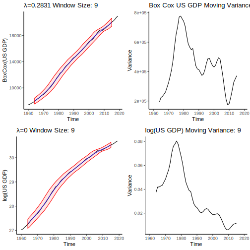

<script>
function onClick(button) { 
  var image_id = button.name; 
  var image_node = document.getElementById(image_id);
  image_node.src = "images/"+ button.value ;
}
</script>

```{r setup, include=FALSE}
knitr::opts_chunk$set(echo = TRUE)
```

```{r, include=FALSE}
#Packages 

library(dplyr)
library(ggplot2)
library(forecast)
library(fpp2)
library(fma)
library(zoo)
library(cowplot)
```


```{r}
wdi_data <- read.csv('WDI2.csv', na.strings = c("..")) %>% 
  select(Country=Country.Code, Value=Series.Name, contains("X")) %>% 
  filter(Country=="USA") %>% 
  data.frame()

#wdi1 <- wdi_data[c(10, 11, 15, 16, 17, 18),]
wdi2 <- t(wdi_data)

rownames(wdi2) <- c("Country", "Value",1960:2019)
colnames(wdi2) <- wdi2[2,]

wdi <- wdi2[-(1:2),] 
wdi <- wdi %>% as.data.frame() %>%  mutate_each(funs(as.numeric))
row.names(wdi) <- row.names(wdi2)[3:length(row.names(wdi2))]
wdi_ts <- ts(wdi, start = 1960)
#tail(wdi)

```


```{r}
US_GDP <- as.ts(ts(wdi[,"GDP (current US$)"], start = 1960, frequency = 1))
```


1) Forecast US GDP growth   


## **1) Forecasting model:**  

  a) Check for constant variance: employ either log transformation or Box-Cox transformation if needed.  
    - in either case we will back-transform our forecasts so they can be reported in our original scale for interpretation.  
    
To determine if our data has non-constant variance, we will draw a one standard deviation band around our data calculated from a moving window. If our data has constant variance, then we should expect this band to be uniform width across time. Further, we'll look at the variance of our data with a moving window, we should expect this plot to have an approximately constant mean across time. We'll also look at how increasing the window size effects both graphs.    

<div>
<input id="moving-average-button" type="number" name="variance" data-device=".svg" data-prefix="GDP_variance_" onchange="valueCheck(this)" value="9" defaultvalue="9" min="3" max="20" autocomplete="off"> <button name="moving-average-button" onclick="animateVariance(this)">Animate Window Size</button></input>
</img>
</div>
<script>
function valueCheck(object){
  let value = parseInt(object.value);
  let max = object.max;
  let min = object.min;
  if(value > max){
  object.value = max
  } else if (value < min){
  object.value = min
  }
  var image = document.getElementById(object.name) ;
  var prefix = object.getAttribute("data-prefix") ;
  var device = object.getAttribute("data-device") ;
  let image_location  = "images/"+object.name+"/"+prefix+object.value+device ;
  console.log(image_location);
  image.src = image_location 
}
</script>
<script>
function animateVariance(object){
  var mab = document.getElementById(object.name);
  console.log(mab.value);
  let min = parseInt(mab.min) ;
  let max = parseInt(mab.max) ;
  function increment(num, max){
    if(num < max){
    let new_num = num + 1 ;
    mab.value = new_num.toString() ;
    mab.dispatchEvent(new Event('change'));
    setTimeout(increment, 500, new_num, max);
    } else {}
  };
  setTimeout(increment, 600, min, max, min);
}
</script>

```{r, eval=F, include=F}
# Code to generate SVG graphics for the animations above. Very lightweight compared to .png files.
mav_plot <- function(time_series, mav_size, titles = c("Window Size: ", "US GDP Moving Variance: "), ylabel = "US GDP"){
  moving_variance <- rollapply(time_series, width = mav_size, FUN = var, fill = NA)
  moving_average <- rollmean(time_series, k = mav_size, fill = NA)
  
  lower_var <- moving_average - sqrt(moving_variance) 
  upper_var <- moving_average + sqrt(moving_variance)
  
  #Ribbon plot
  vari <- autoplot(time_series) + 
    autolayer(moving_average, series = "Moving Average", color = "blue", alpha = 0.9) + 
    geom_ribbon(aes(ymax = upper_var, ymin = lower_var), color = "red", fill = "red", alpha = 0.1) + 
    ylab(ylabel) + ggtitle(paste0(titles[1], mav_size)) + theme_classic()
  
  #variance_plot
  mav <- autoplot(moving_variance) + theme_classic() + ggtitle(paste0(titles[2],mav_size)) + ylab("Variance")
  output <- list("Ribbon" = vari, "Variance" = mav)
  return(output)
}

for(i in 3:20){
  hmm <- mav_plot(US_GDP, i)
  plot_to_save <- plot_grid(hmm[[1]], hmm[[2]], ncol = 1)
  
  save_name = paste0("GDP_variance_", i,".svg")
  ggsave(save_name, plot = plot_to_save, path = "./images/variance/", device = "svg")
}

```

It should be clear that we need to transform our data because the variance is no (approximately) constant throughout time. Here's a comparison of the automatically selected BoxCox transformation (lambda is automatically selected) versus a log transformation: 

<div>
<input id="transformed-average-button" type="number" name="transformed" data-device=".svg" data-prefix="transformed_US_GDP_" onchange="valueCheck(this)" value="9" defaultvalue="9" min="3" max="20" autocomplete="off"> 
<button name="transformed-average-button" onclick="animateVariance(this)">Animate Window Size</button>
</input>
</img>
</div>

```{r, eval=F, include=F}
lamb <- BoxCox.lambda(US_GDP)
transformed <- BoxCox(US_GDP, lambda = lamb)

for (i in 3:20){
  boxcox_version <- mav_plot(transformed, i, titles = c(paste0("λ=", round(lamb, digits = 4), " Window Size: "), "Box Cox US GDP Moving Variance: "), ylabel = "BoxCox(US GDP)")
  log_version <- mav_plot(log(US_GDP), i, titles = c("λ=0 Window Size: ", "log(US GDP) Moving Variance: "), ylabel = "log(US GDP)")
  plot_to_save <- plot_grid(boxcox_version[[1]], boxcox_version[[2]], log_version[[1]], log_version[[2]], ncol = 2)
  save_name <- paste0("transformed_US_GDP_",i,".svg")
  ggsave(save_name, plot = plot_to_save, path = "./images/transformed/", device = "svg")
}
plot_to_save <- plot_grid(mav, vari, mav2, vari2, ncol = 2)
plot_to_save

```

    
  b) Compare forecasting models (naive, seasonal naive, drift).  
    - the three simple forecasting models will be used to forecast 5 years past 2013.  
    - the forecasts will be visualized with their shaded confidence intervals.  
 
# Forecasting {.tabset}
 
 Here we'll be looking at three different naive forecasting methods:
 
```{r, include = FALSE}
less <- window(US_GDP, end = c(2013))
#autoplot(less)
```
 
 
## Naive
 
 As you can see, due to the log transform of our data, the 95% and 80% confidence intervals have been skewed towards larger predictions (i.e., the larger the time, the larger variance in positive predictions). However, it's important to check the residuals of our forecast!
 <div display="block">
 <button name="naive_forecast" onclick="updateForecast(this)" value="original.svg">Original Scale Forecast</button>
 <button name="naive_forecast" onclick="updateForecast(this)" value="clipped.svg">Clip Y-axis Forecast</button>
 <button name="naive_forecast" onclick="updateForecast(this)" value="log.svg">Log Scale Forecast</button>
 </div>
 </img>

 <script>
 // Forcibly updates the image source to what it is supposed to be. Knitting replaces it with some nonsense. 
 (function fixsrc(){
 document.getElementById("naive_forecast").src = "./images/naive_forecast/original.svg";
 })()
 </script>
 <script>
 function updateForecast(button){
 let img = document.getElementById(button.name);
 let str = img.src;
 var lastSlash = str.lastIndexOf("/");
 var prefix = str.substring(0, lastSlash+1);
 console.log(prefix+button.value);
 img.src = prefix+button.value ;
 }
 </script>
 
 
```{r, eval = F, include = F}

#Generates all the plots for Naive Forecasting.

nfit <- naive(less, lambda = 0, h = 5)
plotted <- autoplot(less) + autolayer(nfit, alpha = 0.8, series = "Naive", col = "blue") + 
  ggtitle("US GDP: Naive Forecast (clipped scale)") + ylab("US GDP") + theme_bw() + coord_cartesian(ylim=c(0,100))
ggsave("clipped.svg", plot = plotted, path = "./images/naive_forecast/", device = "svg")


plotted <- autoplot(less) + autolayer(nfit, alpha = 0.8, series = "Naive", col = "blue") + 
  ggtitle("US GDP: Naive Forecast") + ylab("US GDP") + theme_bw()
ggsave("original.svg", plot = plotted, path = "./images/naive_forecast/", device = "svg")


tnfit <- naive(transformed, h = 5)
plotted <- autoplot(transformed) + autolayer(tnfit, alpha = 0.8, series = "Naive", col = "blue") +
  ggtitle("Log(US GDP): Naive Forecast") + ylab("Log(US GDP)") + theme_bw()
ggsave("log.svg", plot = plotted, path = "./images/naive_forecast/", device = "svg")

```
 
```{r}
nfit <- naive(less, lambda = 0, h = 5)
checkresiduals(nfit)
```
 
## Drift
<div style="display:block">
 <button name="drift_forecast" onclick="updateForecast(this)" value="original.svg">Original Scale Forecast</button>
 <button name="drift_forecast" onclick="updateForecast(this)" value="clipped.svg">Clip Y-axis Forecast</button>
 <button name="drift_forecast" onclick="updateForecast(this)" value="log.svg">Log Scale Forecast</button>
 </img>
</div>
 <script>
 // Forcibly updates the image source to what it is supposed to be. Knitting replaces it with some nonsense. 
 (function fixsrc(){
 document.getElementById("drift_forecast").src = "./images/drift_forecast/original.svg";
 })()
 </script>
 
 
```{r, eval = F, include = F}

#Generates all the plots for Naive Forecasting.

drift <- rwf(less, drift = TRUE , lambda = 0, h = 5)
plotted <- autoplot(less) + autolayer(drift, alpha = 0.8, series = "Drift", col = "blue") + 
  #autolayer(drift$fitted, alpha = 0.8, series = "Drift Line")+
  ggtitle("US GDP: Drift Forecast (clipped scale)") + ylab("US GDP") + theme_bw() + coord_cartesian(ylim=c(0,100))
ggsave("clipped.svg", plot = plotted, path = "./images/drift_forecast/", device = "svg")


plotted <- autoplot(less) + autolayer(drift, alpha = 0.8, series = "Drift", col = "blue") + 
  ggtitle("US GDP: Drift Forecast") + ylab("US GDP") + theme_bw()
ggsave("original.svg", plot = plotted, path = "./images/drift_forecast/", device = "svg")


tnfit <- rwf(transformed,drift = TRUE, h = 5)
plotted <- autoplot(transformed) + autolayer(tnfit, alpha = 0.8, series = "Drift", col = "blue") +
  #autolayer(tnfit$fitted, alpha = 0.8, series = "Drift Line") +
  ggtitle("Log(US GDP): Drift Forecast") + ylab("Log(US GDP)") + theme_bw()
ggsave("log.svg", plot = plotted, path = "./images/drift_forecast/", device = "svg")

```
 
## Seasonal Naive 

 
    
  c) Use cross validation to confirm which simple forecasting method is best.  
    - the forecast accuracy reported will be RMSE. 
    - CV will be performed similarly to the way it was used in a bonus homework question earlier in the semester.  
    - The chosen forecasting model will be the one that performs best in the CV procedure  
    
  d) Perform Box-Jenkins method to fit ARIMA(p,d,q) model  
    - the procedure outlined in the slides will be used, and after the p, d, q orders have been chosen they will be compared with the ARIMA found using auto.arima.  
    - the method of comparison will be AIC and RMSE.  
    
  e) Validate best model looking at metrics  
    - AIC and Test RMSE will be used to choose the between the selected ARIMA and the selected simple forecasting method. 
    - these metrics were chosen instead of cross validation because of manual selection process of the best ARIMA model.  
    
  f) Check residuals to further validate best model choice as well as confirm goodness of fit and quality of predictions.